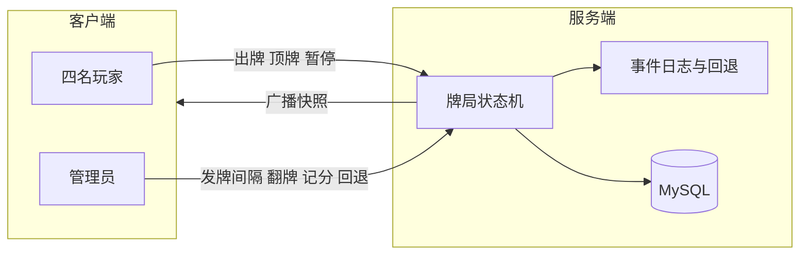

# 四人双扣向棋牌 — 需求与设计说明

本文档汇总当前已对齐的产品需求，并说明**准备如何实现**（架构、职责边界、关键交互），作为后续开发与验收的依据。

## 设计总览（怎么设计这个游戏）

- **定位**：联机「牌桌模拟器 + 运营控制台」。四人两副牌、对家组队；**规则与算分以人为主**——服务器保证**座位、手牌、中央展示、甩牌/顶牌/发牌/暂停/回退/记分**等状态一致且可恢复，**不**做强牌型裁判，**不**自动按吃墩算贡与胜负分。
- **权力模型**：**普通玩家**负责出牌、顶牌、**暂停**；**管理员**负责发牌节奏、翻牌清中央、回退出牌、手工记分。中央墩上的分牌需保留到管理员翻牌，方便线下数 5/10/K。
- **主牌与比大小**：甩牌**仅一次**定主色；顶牌须与上一手**同结构**，成功则**先**将桌面被顶掉的那份牌**收入手牌**，再**从己手牌中**选出**同等张数**的牌**还给被顶的玩家**（换牌交割），最后由成功者**下一首出**。主牌全序在程序里做成**有序表**（便于以后做提示），首期仍以玩家裁定为准。
- **手牌顺序**：**默认理牌**（一键按花色 + 5/王/3/2 靠左）与**玩家自选理牌**（拖拽或交换位置）并存；**顺序仅存本机**，服务器只认牌 id 集合。
- **部署场景**：**家庭联机**，不设多房间、大厅匹配；服务端内存中**仅一局**（四人连上即同一桌）。**技术选型**：**Node.js + ws + MySQL** + 静态页（Vue3 CDN）；**mysql2** 连接池；牌局状态内存 + 事件序号，广播增量；登录与战绩落库。

---

## 1. 项目概述

- **形式**：四人、两副牌、固定四座位；**对家为一队**（座位 0 与 2 一队，1 与 3 一队，顺序按顺时针约定）。
- **风格**：双扣向（分牌含 5 / 10 / K；存在**主牌 / 副牌**概念；有**甩牌定主**与**顶牌**）。
- **原则**：**牌桌规则以玩家线下约定为准**——系统**不强校验牌型**、**不自动根据吃墩算最终胜负分**；以**能完整打完一局、状态不丢、所有人看得见**为第一目标。
- **辅助**：**任意玩家**可**暂停**；管理员额外负责**发牌节奏**、**回退出牌**、**中央区翻牌**、**手工记分**等，保证对局可运营。

---

## 2. 目标与非目标

### 2.1 目标（首期必达）

| 类别 | 说明 |
|------|------|
| 登录与入局 | 四名玩家连同一服务器即同一局；账号与管理员在后端固定（`玩家1~玩家4`，其中 `玩家1` 为管理员）。 |
| 发牌 | 按座位顺序发牌；支持**发牌间隔**（管理员可调）；支持**暂停 / 恢复**。 |
| 甩牌定主 | **整局仅允许一次「甩牌」**用于确定主花色；甩牌后**不可**再由他人甩牌改主。主/副划分以此甩牌花色为基准（与既有「常主点数」规则一致的部分在逻辑层实现，见第 5 节）。 |
| 顶牌 | 仅针对「甩牌后的顶牌流程」：**结构必须与上一手一致**（对子、连对长度一致等）。**顶牌成功**：**收牌**——桌面被顶掉的那份牌**加入顶牌玩家手牌**；**还牌**——成功者须再指定**同等张数**的牌（自手牌中）**还给被顶的玩家**；**下一手由顶牌成功者先出**。 |
| 中央展示区 | 玩家出的牌显示在**场面中央**；在管理员操作前**不自动消失**。 |
| 翻牌 | **仅管理员**可执行「翻牌/收墩」类操作，用于结束当前中央展示（便于玩家自己数分）。 |
| 理牌 | **默认**：一键按花色整理，**5、大小王、3、2** 按约定顺序靠左（与现有习惯一致）。**自选**：玩家可**自行整理手牌**（如拖拽排序、两两交换），顺序**仅本机有效**，不影响他人；出牌/顶牌/还牌仍以提交的 **牌 id** 为准。 |
| 手工记分 | 管理员输入**一队视角的分数**（可为负数）；**全员可见**；负数表示**另一队在记分到该参考队名下**的相对结果（单标量账本）。 |
| 数据 | 持久化玩家身份与**胜负场次等统计**（具体字段见第 9 节）；对局过程可记录事件日志便于**回退**与审计。 |

### 2.2 非目标（首期刻意不做或仅预留）

- **供（贡）**：「20 分一个供、下一局给对方一张牌」等由**玩家自行执行与计算**；系统**不自动换算供、不自动执行贡牌**（若以后要自动化，再单独开需求）。
- **自动算分**：不按吃墩自动累加 5/10/K 台分（玩家自己看中央牌面数分）。
- **严格牌型校验**：不按国标强制拦牌；非法组合若出现，以**管理员回退**与**口头规则**处理。

### 2.3 手牌理牌（默认与自选）

- **默认理牌**：提供「一键理牌」按钮，规则同表格：花色分组，**5 → 王 → 3 → 2** 等优先靠左。
- **自选理牌**：玩家可随时**拖拽**调整手牌顺序，或提供「选中两张交换」等轻量交互；**不**把顺序同步到服务器，**不**在其他玩家界面展示你的排序。
- **与协议的关系**：服务端只保存每位玩家的 **手牌集合**（牌 id）；客户端用本地 `order[]` 渲染；提交 `play` / `cover` / 还牌时带 **具体 cardIds**，与当前排序一致即可。
- **新牌入手的插入策略**（实现时二选一或做设置）：新发的牌默认**接在末尾**，或**触发一次默认理牌**（可配置）。

---

## 3. 角色与权限

| 角色 | 权限概要 |
|------|----------|
| 普通玩家 | 准备/就绪、出牌、参与顶牌（在轮到且规则允许时）、**暂停**（**任意玩家**可随时暂停全局节奏）、**手牌自选排序**（仅本机）。 |
| 管理员 | 上述全部 + **发牌间隔**、**回退出牌**、**中央区翻牌**、**手工改分**、以及局内控制（与现有实现对齐的可扩展项）。 |

**唯一管理员**：四人中**同时仅一名**为管理员，且由后端固定配置（首期固定为 `玩家1`）。前端不提供管理员分配/移交交互。

**翻牌**：**仅管理员**可点，避免误清导致无法对点。

---

## 4. 本局座位与队伍

- **无多房间**：服务端只维护**一局**；家人各自打开页面连同一地址即可。
- **局状态**（示意）：`waiting` → `playing` → `finished`（中间可加 `paused` 作为跨状态标志）。
- **座位**：0、1、2、3 顺时针；**队伍**：`team0 = {0,2}`，`team1 = {1,3}`。
- **出牌顺序**：顺时针；**顶牌成功后**完成**收牌 + 还牌**交割，再由成功者**获得下一手首出权**。

---

## 5. 牌与主牌逻辑（程序侧「弱规则」）

> 本节用于统一客户端展示与**可选**的「比大小」辅助（若将来要做提示）；**首期仍以玩家裁定为主**。

- **分值（固定、不可改配置）**：建议写死为 **5 = 5 分，10 = 10 分，K = 10 分**（两副牌各自计分牌张数）。
- **常主点数**：2、3、5、王为常主（全花色上的该点数）。
- **主花色**：由**唯一一次甩牌**锁定的花色决定；该花色下非上述点数的牌亦为**主门子**（如「本门 4」）。
- **主牌大小序**（实现时做成可配置有序表，便于调参）：按已讨论的方向，例如 **天 5（主花色 5）> 大王 > 小王 > 闲 5 > 本 3 > 闲 3 > 本 2 > 闲 2 > 主 A > 主 K > …**，余下副牌再补全全序；**多副同阶**需定义 tie-break。

**甩牌**：仅第一次宣告甩牌有效并**定主**；之后他人不可再甩牌改主。

**顶牌**：必须与上一手**结构一致**；判定成功后：**（1）** 桌面被顶的那份牌进入**顶牌方**手牌；**（2）** 顶牌方从手牌中指定 **N 张**还给**被顶的玩家**，**N = 刚收入的那一份牌的张数**（一对一置换张数，不按牌型强制匹配）；**（3）** 由顶牌方**下一首出**。若采用两包消息，可先 `cover` 比大小再 `coverExchange` 带归还牌 id，最终以一次原子状态更新为准。

---

## 6. 中央展示区与翻牌

1. 玩家出牌后，牌面置于**中央区域**，全员可见。
2. 在中央牌未处理前，**不自动清空**，便于玩家对 5/10/K **人工计分**。
3. **仅管理员**点击「翻牌/收墩」后，中央区清空或进入「已结算」视图（首期可做**直接清空**）。
4. 是否与「下一墩出牌」绑定：建议 **翻牌表示本墩展示结束**，下一手出牌仍按游戏规则由当前「首出权」持有者决定（与顶牌、轮庄逻辑一致）。

---

## 7. 暂停、发牌间隔、回退

- **暂停 / 恢复**：全局暂停发牌计时与（若有的）回合计时；**任意玩家**均可发起暂停/恢复。
- **发牌间隔**：管理员设定范围（如 100ms–5000ms），按序发牌。
- **回退出牌**：维护**出牌历史栈**；管理员按序号或最近一次回滚，恢复手牌与中央区状态（与手工记分冲突时以**最后一次明确指令**或提示管理员为准）。

---

## 8. 记分（手工）

- **输入**：仅管理员（或明确授权者）输入/修改。
- **展示**：**全员可见**；采用 **「一队视角」单标量**（例如「1 队分数」）：
  - **正数**：该队领先或得分占优（具体含义由玩家约定）。
  - **负数**：表示**另一队**在该记账方式下「记在 1 队头上」为负向（即对家得分占优的一种单账本表示）。
- **系统**：不做自动验算与供的换算；可选在 UI 上**仅展示**两队派生值（如 `team1 = -team0`）若产品需要，但以**管理员输入的那一列**为准。

---

## 9. 数据与持久化（设计意向）

- **玩家**：账号、昵称、密码哈希、创建时间等。
- **统计**：场次、胜场、负场、最近对战时间；可扩展累计分差不自动写死。
- **对局**：可选会话标签（如 `family`）、开始/结束时间、参与者与座位、可选 `winner_team`（若玩家最后手动确认）、原始事件序列引用。
- **事件日志**：用于回放与管理员回退（`seq` 单调递增）。

持久化采用 **MySQL**（`mysql2` 驱动、连接池）；库名、账号等通过环境变量配置（如 `MYSQL_HOST`、`MYSQL_DATABASE` 等）；表结构在实现阶段落 DDL，与现有 `server/database.js` 对齐。

---

## 10. 技术架构（准备如何实现）

| 层次 | 说明 |
|------|------|
| 服务端 | Node.js + **ws**；**单局**牌局状态驻内存；**状态机**驱动阶段（等待 → 发牌中 → 游戏中 …）。 |
| 数据库 | **MySQL**（`mysql2` 连接池）；玩家、对局、战绩等表；部署前需**创建库**并配置环境变量。 |
| 协议 | JSON 消息：`join`、`playersUpdate`（玩家列表同步）、`play`、`throwTrump`（甩牌）、`cover`（顶牌，可含或与后续包合并 **归还牌列表**）、`pause`、`resume`、`setDealInterval`、`undo`、`adminFlipCenter`、`setScore`、`endGame`（管理员结束本局）等（名称以最终实现为准）。 |
| 客户端 | 静态页 + Vue3 CDN；**游戏桌面页**负责手牌、中央区、管理员面板；**理牌**为纯前端（默认排序 + **可拖拽自选顺序**）。 |
| HTTP | 静态资源由简易 HTTP 服务提供（与现有 README 一致）；生产可换任意静态托管。 |

**同步要点**：所有影响可见状态的操作经服务器**广播**同一快照或增量，避免客户端各自为政。

---

## 11. 验收关注点（首期）

1. 四人能稳定入局、发完牌、能出牌、甩牌只生效一次定主。  
2. 顶牌结构一致；成功后**收牌、还牌（张数一致）、下一首出**均正确。  
3. 中央牌常驻至管理员翻牌。  
4. 管理员可改分且全员同步；分数可为负。  
5. 暂停、发牌间隔、回退在联机环境下可用。  
6. 手牌支持**一键默认理牌**与**玩家拖拽自选顺序**，出牌提交与排序一致。  

---

## 12. 未决与后续迭代（记录用）

- 「供」与「20 分一供」的**自动化**与**发牌前贡牌流程**。  
- 是否对顶牌/甩牌做**可选**的客户端校验提示。  
- 中央区**历史墩**列表（翻牌后仍可查）。  

---

*文档版本：与当前对话对齐；实现时若有冲突以评审结论为准。*
